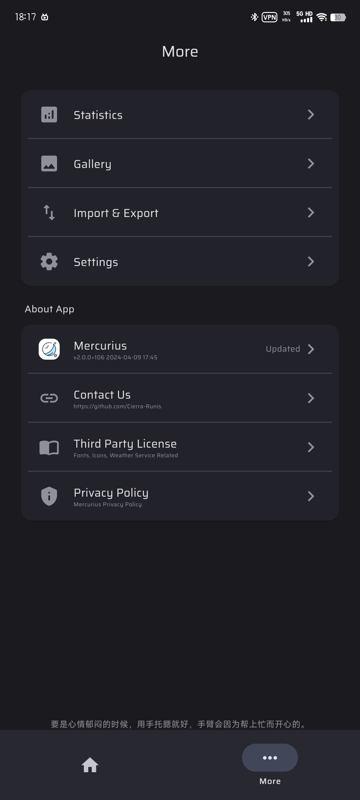

  

  
『 Mercurius - 日記を書きましょう！』

<a href="https://github.com/Cierra-Runis/mercurius/blob/master/README.md">English</a> | <a href="https://github.com/Cierra-Runis/mercurius/blob/master/.github/README_zh.md">中文</a> | <a href="https://github.com/Cierra-Runis/mercurius/blob/master/.github/README_ja.md">日本語</a>

`最後の更新は：2024-04-09 18:36:55`

[📚 紹介](#-紹介)

[📸 例](#-例)

[📦 使用方式](#-使用方式)

[📌 注意事項](#-注意事項)

[🧑‍💻 貢献者](#-貢献者)

[🔦 声明](#-声明)

# 📚 紹介

本ソフトウェアは [Flutter](https://flutter.dev/) に基づいて開発された日記ソフトで、`Android` および `Windows` プラットフォームを支持する、`iOS` および `macOS` プラットフォームのサポートが予定されています

実現した一部の機能は次の通りです：

- 一日多日記共存を支持する

- リッチテキスト編集を支持する

  1. 太字、イタリック、小文字サイズ、下線、削除線などの文字属性を支持する

  2. 左揃え、中央揃え、右揃えなどの文字揃え方式を支持する

  3. 大、中、小三級タイトルと普通文字を支持する

  4. 引用、画像、タグの挿入機能を支持する

  5. 日記の気分、天気、帰属日などの属性の修正を支持する

- 全文検索を支持する

- 日記のインポートとエクスポートを `json` フォーマットに支持する

- 日記データ統計と正規表現を支持する

- より多くの機能を期待してください

# 📸 例

## 🌕️ ダークモード

  
  
  
  
  
  

## 🌞️ ブライドモード

  
  
  
  
  
  

# 📦 使用方式

- `Android` の場合

  [リリースページ](https://github.com/Cierra-Runis/mercurius/releases) で最新バージョンの `app-arm64-v8a-release.apk` をダウンロードすれば良いです

- `Windows` の場合

  [リリース ページ](https://github.com/Cierra-Runis/mercurius/releases) で最新バージョンの `Mercurius.for.Windows.zip` をダウンロードして解凍し、`Mercurius.exe` をダブルクリックすれば良いです

# 📌 注意事項

- 更新ページの破壊的更新リストに表示された関連情報に注意し

- アップグレード後のデータの損失を防ぐため、タイムリーに積極的に「インポート・エクスポート」機能を使って日記データをバックアップしてください

# 🧑‍💻 貢献者

# 🔦 声明

このプロジェクトは `GPL-3.0` ライセンス契約を採用しています、詳細は [LICENSE](https://github.com/Cierra-Runis/mercurius/blob/master/LICENSE) をご覧ください

Mercurius が導入したオープンソースライブラリなどの情報については、Mercurius ソフトウェア内の `アプリについて` ページを参照してください

[android & iOS icon generator](https://www.appicon.co/)

[macOS icon generator](https://www.candyicons.com/free-tools/app-icon-assets-generator)
