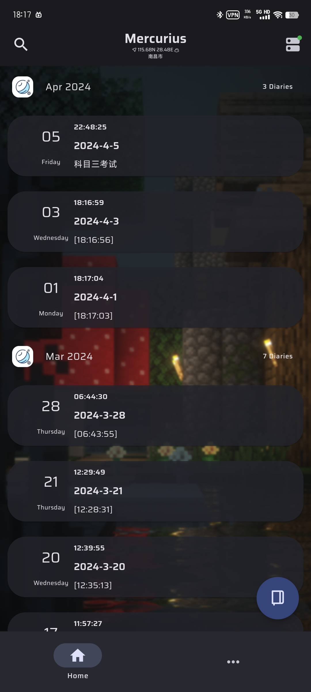
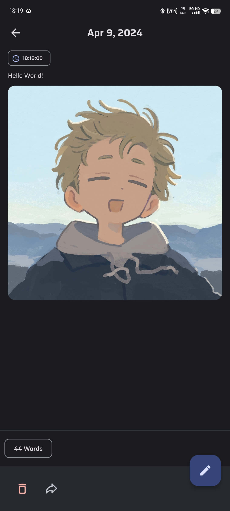
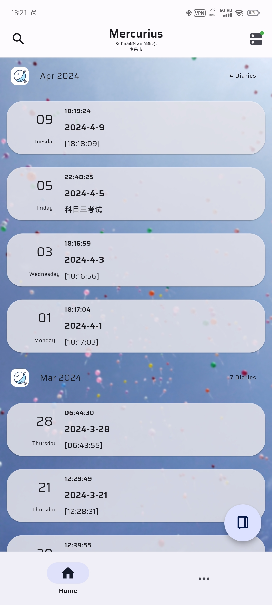

  
  
『 Mercurius - 记点日记！』

[📚 简介](#-简介)

[📸 示例](#-示例)

[📦 使用方式](#-使用方式)

[⏳ 进度](#-进度)

[📌 注意事项](#-注意事项)

[🧑‍💻 贡献者](#-贡献者)

[🔦 声明](#-声明)

# 📚 简介

本软件是基于 [Flutter](https://flutter.dev/) 开发的一款日记软件，已实现的部分功能如下：

- 支持一日多日记共存
- 支持富文本编辑
  1. 支持粗体、斜体、小字号、下划线、删除线等文字属性
  2. 支持左对齐、居中对齐、右对齐等文字对齐方式
  3. 支持大、中、小三级标题和普通文字
  4. 支持插入引言、图片、时间标签功能
  5. 支持修改日记心情、天气、归属日期等属性
- 支持全文搜索
- 支持导入导出日记为 `json` 格式
- 支持日记数据统计
- 更多功能尽情期待

# 📸 示例

## 🌕️ 常暗模式

  
  
  
  
  
  

## 🌞️ 常亮模式

  
  
  
  
  
  

# 📦 使用方式

请在 [Releases](https://github.com/Cierra-Runis/mercurius_warehouse/releases) 中选择下载安装最新版本的 `app-arm64-v8a-release.apk` 即可

# ⏳ 进度

持续更新中

# 📌 注意事项

- 目前还是非正式版，版本更新过程中可能会有一定的数据丢失风险，请及时主动使用 `导入导出` 功能备份日记数据

# 🧑‍💻 贡献者

# 🔦 声明

- 源代码仓库为闭源仓库，不对外公开
- 更多详细信息已在软件内标注
