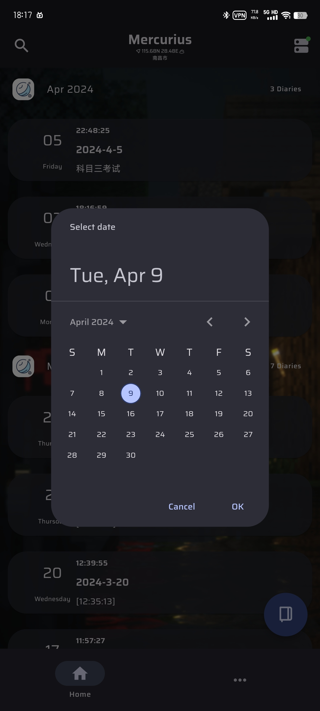
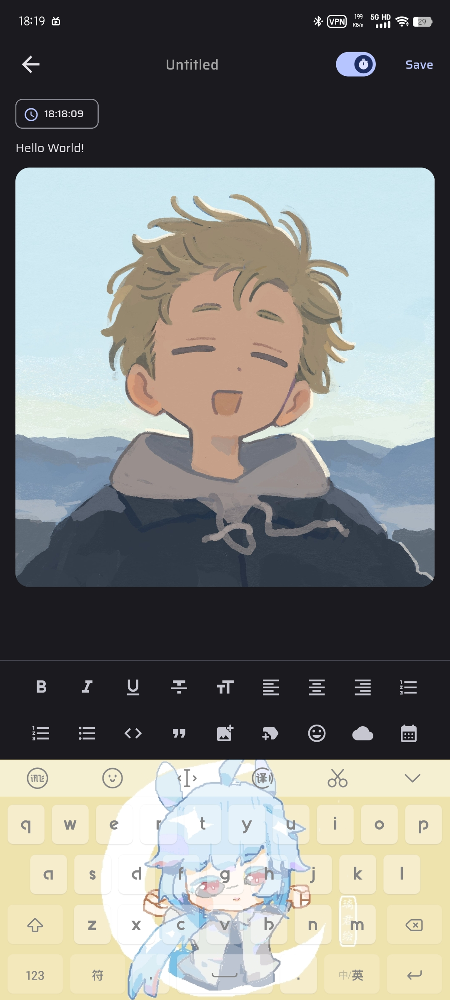
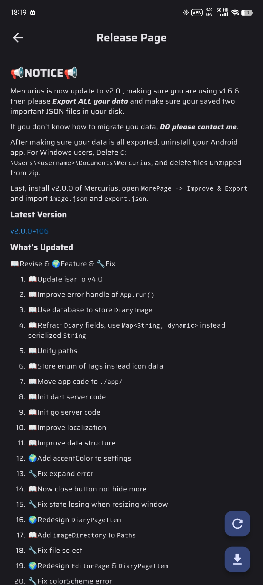
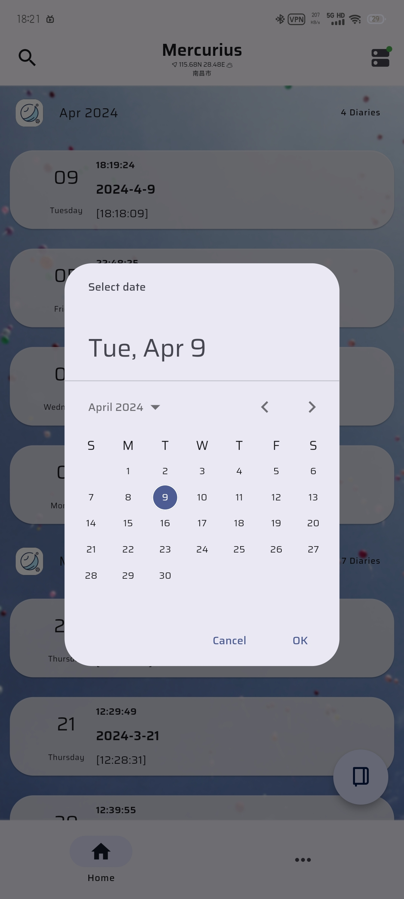
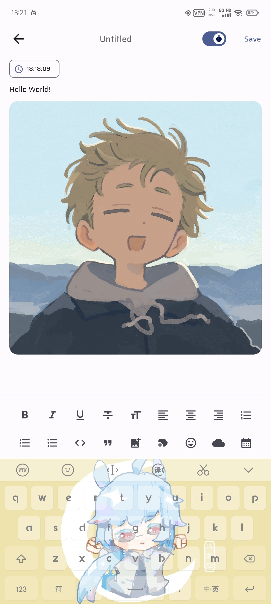
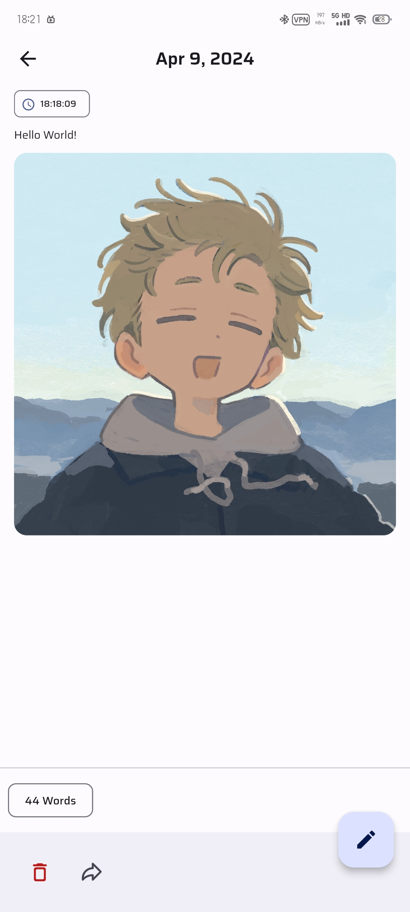

  

  
〠Mercurius - Write Some Diaries!ã€

  <a href="https://github.com/Cierra-Runis/mercurius/blob/master/README.md">English</a> | <a href="https://github.com/Cierra-Runis/mercurius/blob/master/README_zh.md">中文</a> | <a href="https://github.com/Cierra-Runis/mercurius/blob/master/README_ja.md">日本語</a>

`Latest update: 2023-06-22 03:00:00`

[📚 Introduction](#-Introduction)

[📸 Screenshots](#-Screenshots)

[📦 How to use](#-How-to-use)

[⏳ Rate of progress](#-Rate-of-progress)

[📌 Cautions](#-Cautions)

[🧑‍💻 Contributor](#-Contributor)

[🔦 Declaration](#-Declaration)

---

# 📚 Introduction

`Mercurius` is a diary application developed based on [Flutter](https://flutter.dev/), and some of the realized functions are as follows:

- Support the coexistence of diary in one day

- Support rich text editing

  1. Support text attributes such as bold, italic, small font size, underline, delete line, etc

  2. Support left alignment, center alignment, right alignment and other text alignment methods

  3. Support large, medium and small three-level titles and ordinary characters

  4. Support the function of inserting refers, images and time tags

  5. Support to modify diary mood, weather, date and other attributes.

- Support full-text search

- Support import and export diary in `json` format

- Support diary data statistics

- Looking forward to more functions...

# 📸 Screenshots

## 🌕️ Dark Mode

  

  

  

  

  

  

## 🌞️ Bright Mode

  

  

  

  

  

  

# 📦 How to use

Go [Releases Page](https://github.com/Cierra-Runis/mercurius/releases) and select the latest version of `app-arm64-v8a-release.apk` to download and install it

# ⏳ Rate of progress

Official version has been released

# 📌 Cautions

- Please pay attention to the relevant information marked in the list of breaking updated versions on the update page
- and actively use the `import and export` function to back up diary data in time to prevent data loss after upgrading the version

# 🧑‍💻 Contributor

# 🔦 Declaration

This project is licensed under the terms of the `GPL-3.0` license. See [LICENSE](https://github.com/Cierra-Runis/mercurius/blob/master/LICENSE) for more details

For information about the open source library introduced by Mercurius, see the `About` page in Mercurius
